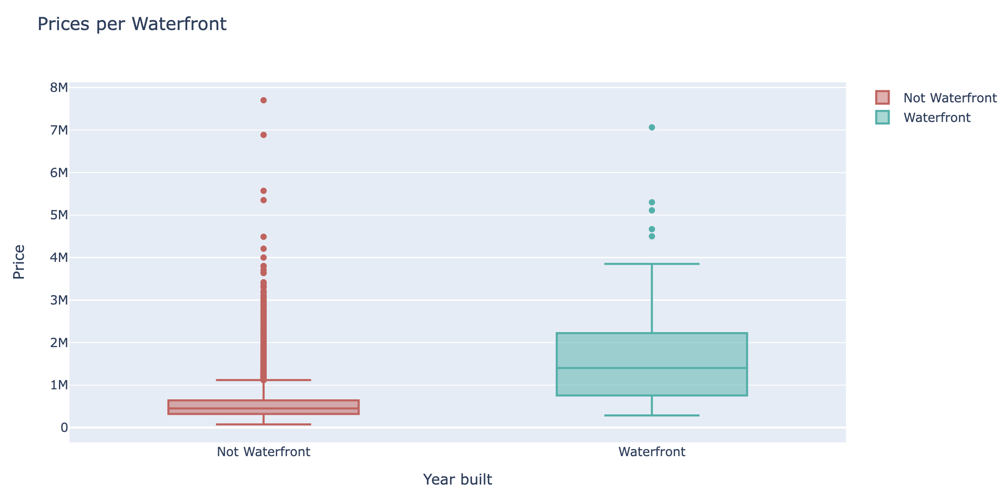

# House Rocket - Insight Project

  

This is an insight project where a data base from house sales in the King County (USA) was used to generate insights to help the CEO on making decisions about buying and selling properties. The *kc_house_data* can be found on [Kaggle](https://www.kaggle.com/harlfoxem/housesalesprediction). 

Here, you can find the final dashboard for this project: [House Rocket App](https://house-rocket-insightapp.herokuapp.com/)

Below, you can find the __dataset dictionary__.

**Variable** | **Meaning** 
--- | --- 
`id`  | Unique ID for each home sold
`date`| Date of the home sale
`price` | Price of each home sold
`bedrooms` | Number of bedrooms
`bathrooms` | Number of bathrooms, where .5 accounts for a room with a toilet but no shower
`sqft_living` | Square footage of the apartments interior living space
`sqft_lot` | Square footage of the land space
`floors` | Number of floors
`waterfront` | A dummy variable for whether the apartment was overlooking the waterfront or not
`view` | An index from 0 to 4 of how good the view of the property was
`condition` | An index from 1 to 5 on the condition of the apartment,
`grade` | An index from 1 to 13, where 1-3 falls short of building construction and design, 7 has an average level of construction and design, and 11-13 have a high quality level of construction and design.
`sqft_above` | The square footage of the interior housing space that is above ground level
`sqft_basement` | The square footage of the interior housing space that is below ground level
`yr_built` | The year the house was initially built
`yr_renovated` | The year of the house’s last renovation
`zipcode` | What zipcode area the house is in
`lat` | Lattitude
`long` | Longitude
`sqft_living15` | The square footage of interior housing living space for the nearest 15 neighbors
`sqft_lot15` | The square footage of the land lots of the nearest 15 neighbors

# Business question

We have two main questions:

1. What are the real states House Rocket should buy, and how much will it cost?
2. What is the best moment to sell the real states, and how much will it cost? 
    
# Business assumptions 

- We assumed that the season and region have an impact on the houses prices.
- We considered old houses as the ones built before 1955.
- For each region and for houses in good conditions, we considered houses suitable for buying the ones whose price is smaller than the average price in the region.
- For each region + season, we calculate the mean price and stated the sales condition as the follow:
   + If the house price is bigger than the median of region + season
      + The sale price will be the purchase price + 10 %
   + If the house price is lower than the median of region + season
      + The sale price will be the purchase price + 30 %

# Solution Planning

1. Collect the data on Kaggle
2. Change the data type for appropriate one for some features
3. Create new features
  - `month` 
  - `year`
  - `old`
  - `season`
  - `basement`
  - `is_waterfront`
4. Test the hypothesis

# Main business insights

- New houses(built from 1955) are not substantially more expensive than old houses (built before 1955), on average they are only 0.78% cheaper. So it worth to buy new houses, because we know they are not so expensive as we expected.
- Houses without basement are 22.56% bigger in total area than houses with basement. It means that, if we want bigger total area we should choose houses without basement.
- Waterfront houses are 212.64% more expensive, on average. Waterfront houses are more expensive than expected, so we should only buy houses like that if the profit is good. 

# Business results

## H1: Houses with waterfront are, on average, 30% more expensive.

**Conclusion**: FALSE. Houses with waterfront are, on average, 212.64% more expensive. The mean price of houses without waterfront is U\$ 531,563.60, while this price is, on average, U\$ 1,661,876.025 for waterfront houses.

**Translation for business**: If we want to buy for a smaller price, it is better to invest on houses without waterfront, unless the profit is equally bigger. 

## H2: Houses built before 1955, are 50% cheaper, on average.

**Conclusion**: FALSE. In average, "new" properties (year built >= 1955) are only 0.79% more expensive than the old ones (year built < 1955). The mean price of the old proporties is U$ 537,050.91 while the mean price of new properties is U$ 541,299.97.

**Translation for business**: We can buy new houses because they do not seem to be so expensive, on average, when compared to old houses.

## H3: Houses without basement have total area (sqft_lot) 40% bigger than houses with basement.

**Conclusion**: FALSE. Although the proporties without basement are slightly bigger, they are only 22.56% bigger, not 40%. In average, properties without basement has area 16,284.18 square feet. Properties with basement has an area, in average, of 13,286.30 square feet.

**Translation for business**: It seems houses without basement are bigger on area. If you want bigger area, you should invest in houses without basement. 

## H4: The YoY (Year Over Year)  growth on houses price is 10%.

**Conclusion**: FALSE. The YOY growth was only 0.52% between 2014 and 2015.

**Translation for business**: The house's price did not increase a lot between 2014 and 2015.
 
## H5: Houses with 3 bathrooms have a 15% MoM (Month over Month) price growth.

**Conclusion**: FALSE. The average MoM price growth was only 0.375%.

**Translation for business**: Price of houses with 3 bathrooms do not change month over month.

## H6: Houses are renovated, on average, after 30 years from the built year.

**Conclusion**: FALSE. Houses are renovated, in average, 56.3 years after they are built.

**Translation for business**: Houses renovation takes more time than we expected, so depending on the year built, and of course, house condition, we do not need to worry a lot about renovation in short time.

## H7: The YoY (Year over Year) area growth is - 5%, i. e., the house's size become smaller over year. 

**Conclusion**: FALSE. There is an average increase of 7.23% in the area of the proporties over the years.

**Translation for business**: We do not see a trend on size reduction for the houses' area over time.

## H8: Houses are 20% cheaper on the winter. 
**Conclusion**: FALSE. Although the prices have shown to be smaller in the winter, they are only 3.87% smaller, on average, not 20%.

**Season** | **Price** 
---------- | --------- 
Fall | 529,161.32
Spring | 558,081.05 
Summer | 540,114.84 
Winter | 521,194.66 

**Translation for business**: Houses are cheaper in the winter, on average, but the difference on the average price when compared to the other seasons are not so big.

## H9: In the summer the profit from sale is 35% bigger than the winter season.

**Conclusion**: FALSE. The profit is only 5.82% bigger in the Summer than in the Winter.

**Season** | **Profit** 
---------- | --------- 
Fall	  | 69,685.62
Spring	| 73,085.28
Summer	| 71,852.68
Winter	| 67,900.18

**Translation for business**: From the table above we see that the biggest profit occurs in the Spring, and this season may be the best to sell the houses.

## H10:  Houses with waterfront has an area 25% bigger than the houses without waterfront.

**Conclusion**: FALSE. The total area of waterfront properties are 68.82% bigger than the area of not waterfront ones.

**Translation for business**: If you want houses with bigger areas, waterfront houses are definetely a good choice. 

# Conclusion

With this project we have found interisting insights about the houses. Obviously, much more hypotheis can be tested, but the those that were tested so far answered some questions about selling and buying houses, and now we have sggestions based on the data available to give the CEO. Furthemore, we have implemented the solution in user-friendly dashboard ([House Rocket App](https://house-rocket-insightapp.herokuapp.com/)) where the CEO can select the houses based on some features.
Finally, as a businees result we have that if the houses are sold by the suggested price, the expected total profit would be U$ 760,693,197.90. 
   
# Next Steps

- Explore the possibility to buy houses in bad conditions, renovate and sell them.
- Explore models to predict houses prices based on some features. 
- Test more hypothesis.

